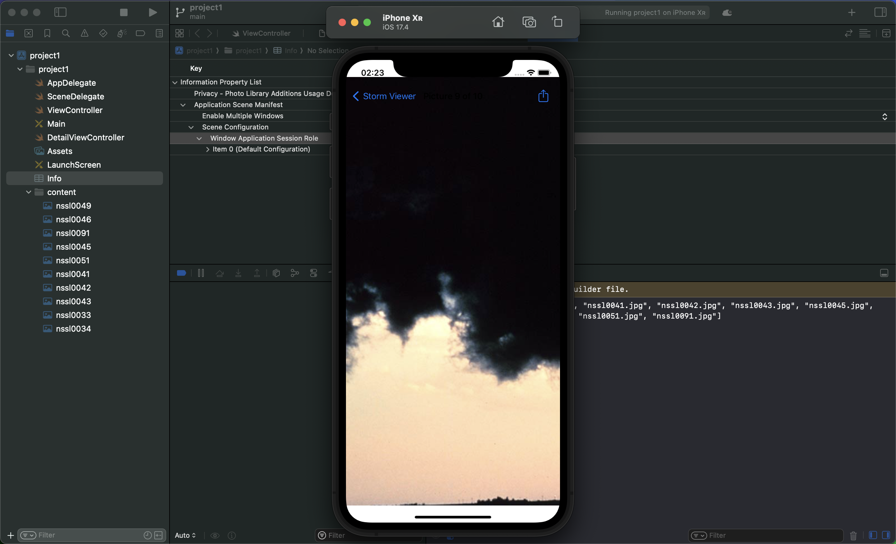
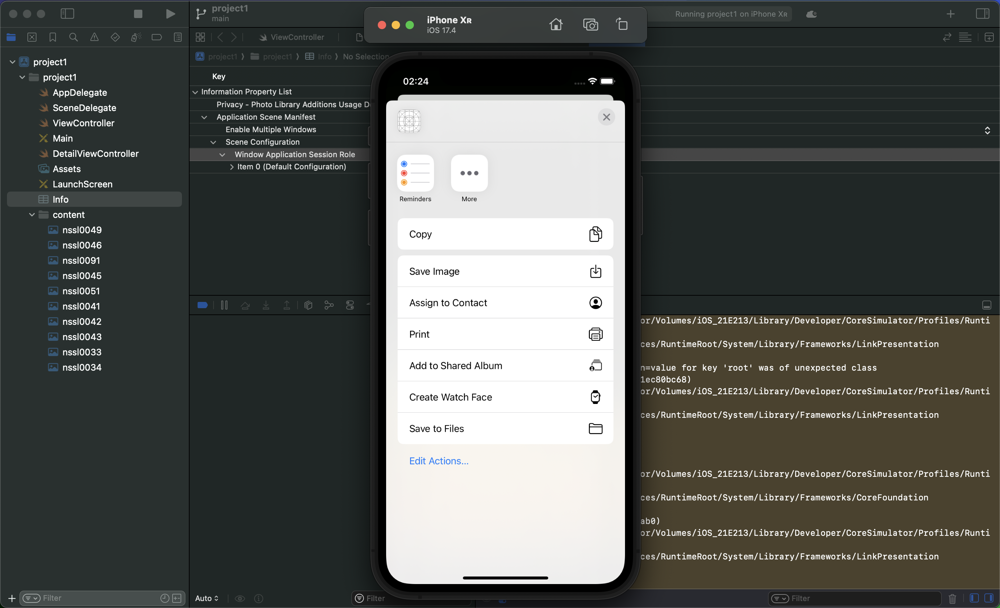

# UIKit

##  Project 3:  UIBarButtonItem and UIActivityViewController.
For app developers, social media is also a chance for our users to talk about our app: to share things they’ve found, or perhaps just to tell the world how much they love it. It helps break the feeling that our app is contained to their device – if we can help them communicate with friends online, they’ll thank us for it.

# Last Update:

